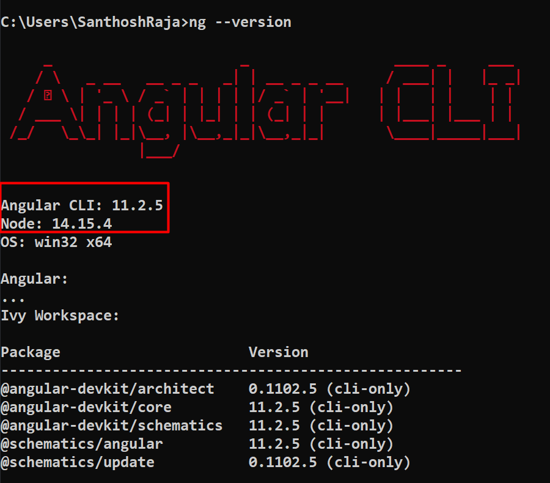

# ZohoEats

This project was generated with [Angular CLI](https://github.com/angular/angular-cli) version 11.2.5.

## How to run the project

1. Clone the project

2. Run `npm install` command

3. Run `npm start` command

## Development server

Run `ng serve` for a dev server. Navigate to `http://localhost:4200/`. The app will automatically reload if you change any of the source files.